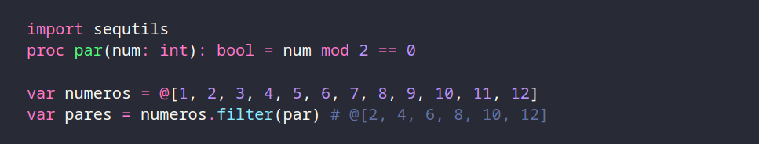

Como prometido no ultimo post, vamos falar um pouco mais a fundo sobre Seq's, e o por que de eu amar tanto elas.

É de importância deixar claro que neste post estarei começando a falar superficialmente sobre funções, o próximo post ainda vai ser sobre outras coleções, porem o seguinte deste seja sobre funções, e nele estarei aprofundando sobre o assunto.

Primeiro, lembrando rapidamente como se cria sequencias, a primeira forma cria uma nova sequencia preenchida, enquanto a segunda aloca a sequencia porem vazia, ao adicionar itens na sequencia criada na primeira forma iremos adicionar no final invés do começo, enquanto na segunda iremos começar do índice 0. Compreendido isso, estarei utilizando a segunda forma.

1 - Adicionar e Remover elementos

A) - Adicionar
Para adicionar baste chamar a função add, passando como parâmetro um valor do tipo da sequencia, ou uma segunda sequencia de mesmo tipo, ou caso queira inserir em um local especifico, use a função insert passando o elemento, junto ao índice desejado.

B) - Remover
Ok, agora para remover elementos tem um detalhe importante. Para remover elementos por índice, é utilizado del, que ele apenas remove o índice e reorganiza a sequencia, isso é mostrado na segunda linha. Porem não tem como remover por valor, então o que podemos fazer, podemos utilizar a função find que recebe um valor, e retorna o índice, caso o item não exista ele retorna -1, desse modo ficaria.

Porem eu tenho uma preferencial por outro modo, que é sobrescrevendo a função del. 

Calma, por favor não foge, não é complicado. Em Nim você pode escrever quantas funções você queira com o mesmo nome, contando que elas possuam diferentes cabeçalhos, o que é conhecido como polimorfismo ou sobrecarga de operadores. Entendido isso, o cabeçalho original da função del é este

ele recebe uma lista de tipo T(qualquer tipo) e um numero(O "*" no nome da função simplesmente diz que ela é uma função publica). Favor ignorar o {.noSideEffect.} por hora, obrigado.

O que eu fiz foi criar uma nova função com um cabeçalho diferente, recebendo uma lista de strings e uma string. E o que a função faz é basicamente o que vimos antes.

Utiliza a função find para encontrar o índice, e caso o item exista, ele remove da lista. O por que de podermos alterar os valores da lista vem de termos declarado s como var, porem irei falar mais sobre no post sobre funções.

2º - Mapeando listas
AVISO: A partir de agora irei me referir a sequencias como "listas" e estarei entrando em um terreno um pouco mais complexo, sugiro voltar aqui depois de estar confortável com o que foi mostrado ate aqui.

Ok, agora vamos entrar no mundo da sequtils, a biblioteca padrão de Nim para se lidar com sequencias de forma mais eficiente. Eu de longe não vou passar por 10% das funções disponíveis, porem, vou passar pelos mais importantes na minha opinião(Especialmente as que quem gosta de funcional não vive sem), caso queira dar uma olhada, aqui esta o link da documentação. Vamos começar com o Big Three: Map, Filter e Reduce, Ou melhor, Big Five.

A) Map e Apply
Primeiro, importa o modulo sequtils. Segundo, criamos uma lista. Terceiro, chamamos map na lista criada passando uma função que recebe o mesmo tipo que os elementos da lista, como mostrado no comentário, Nim permite criação de funções anônimas(e funções em Nim são funções de primeira classe, caso não tenha notado), o que permite que declaremos a função dentro do map. Eu pessoalmente prefiro declarar antes, para não ficar uma linha muito grande, porem, faça como achar mais bonito e mais bonito de postar no Twitter.

Existe outra forma de fazer um Map em Nim, porem para casos onde não queremos gerar uma nova lista, e sim alterar a lista original. Usando a função Apply. O funcionamento é idêntico, chamamos apply na lista que queremos aplicar a função, a diferença é que ele não possui um retorno, e sim alterar a lista original, isso é algo que pode ser útil, lembre disso no futuro.

B) Filter e KeepIf
Filter, tão simples quanto o map, porem no lugar de uma função que recebe um valor, opera em cima dele e retorna, o filter recebe uma função que verifica se algo é verdadeiro ou falso, caso seja verdadeiro, esse valor é retornado, simples.

Igual o map, filter possui uma versão que altera a lista original invés de retornar uma nova lista, sendo o keepIf, que possui um nome bem alto explicativo. Mesmo funcionamento, recebe função, e so manterá na lista os valores que passarem na função. Simples e funcional(nos 2 sentidos).

C) Reduce(Ou Foldl no caso)
Nim não possui reduce, possui foldl, que é similar, porem na minha opinião, é meio complicado, e pelo o que eu consegui entender lendo a documentação, passamos dentro de foldl uma expressão utilizando a e b, sempre passando o valor resultante dessa expressão para a, o que é o comum de se esperar de um reduce, porem o que eu achei estranho, é que não é passado uma função, e sim uma expressão, não chega a ser ruim, porem acho que uma função seria melhor, claro, da para fazer uma gambiarra sobrescrevendo foldl como eu fiz anteriormente com del, porem acho desnecessário, levando em conta que na própria sequtils já tem boa parte do que você vai precisar, e o que você não encontrar é facilmente resolvível, a sintaxe de Nim é fácil de ser manipulada para esse tipo de coisa. 

Por curiosidade, assim ficaria uma função reduce, eu não vou para para explicar pois ainda não expliquei funções, eu quis mostrar pois... por que sim, o guia é meu. 

Acredito que devo explicar o que é a biblioteca "sugar", ela basicamente serve para deixar a sintaxe mais bonitinha e mais simples disponibilizando macros(pfv não me cobrem para falar sobre Macros tão cedo, é um caos), ela permite, como no exemplo, criar funções que recebem funções de uma forma muito mai fácil, bem similar a como é no JavaScript se não me engano. Ela disponibiliza outras coisas úteis para lidar com funções, caso esteja curioso aqui esta o link para a documentação

D) Extras
Tendo explicado as 5 principais funções de mapeamento(por isso Big Five, e não Big Three), aqui estão algumas outras funções famosas que você pode precisar.

Função Zip, retorna uma lista de tuplas contendo cada elemento relativo pelo índice.

Função Unzip, faz o oposto, pega uma lista de tuplas e retorna uma tupla contendo as listas não zipadas.

Função Count, conta quantas vezes um elemento aparece em uma lista.

E por fim, função maxIndex e minIndex, retornam o indexe do maior e o menor valor de uma lista respectivamente.

Ainda existem outras funções mais especificas, porem ou são muito especificas a certos casos ou então podem ser facilmente feitas usando o que foi mostrado aqui, seria coisa de você mostrar o seu codigo para um dev mais esperiente e ele comentar "cara existe a função na sequtils, a RedBingus que resolve isso sem precisar fazer uma função". Caso queira ver tudo que esta disponível, aqui esta o link da documentação.

3º - Papo furado
Pronto, acredito que falei o suficiente para destacar os principais pontos sobre sequencias, e sobre como elas porem ser muito úteis. O próximo post irei falar sobre outras estruturas úteis e comumente utilizadas com funções, para depois disso, trazer o tão esperado post sobre funções. Continuem estudando e nos ajude ma tornar Nim algo real no Brasil.