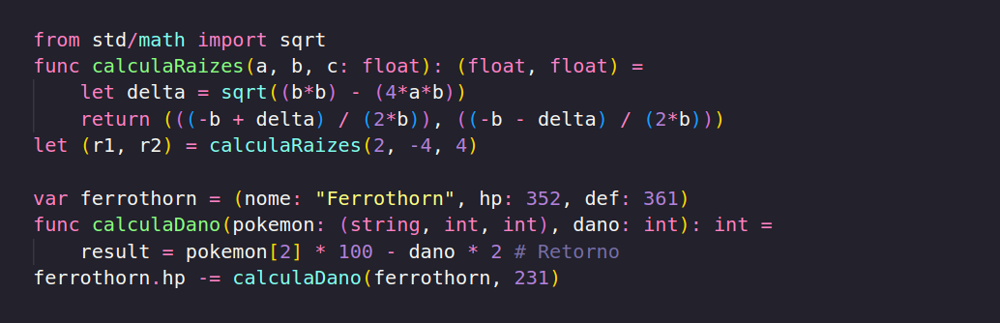

E finalmente funções, a minha parte preferida em qualquer linguagem. Já avisando que é a partir daqui que as coisas vão começar a ficarem um pouco mais complexas. Neste poste vamos cobrir o básico de funções lidando apenas com os tipos mais simples. Após o próximo post, na parte 7 desde guia, vou falar sobre retornos e parâmetros com outros tipos.

Nim possui 2 formas de se criar funções(3 se você contar POO, mas isso vemos depois). A primeira forma utilizando Proc, que permite escrever funções impuras com qualquer efeito colateral que você queira, e Func, que apenas permite a criação de funções puras. Você não sabe o que é uma função pura? Sem problemas, é simples de entender. Qualquer coisa que uma função faça que esteja fora do seu retorno é considerado um efeito colateral, seja alterar os valores passados, printar algo na tela ou receber input, banco de dados, internet… qualquer coisa que n envolva os seus parâmetros e o seu retorno. "Mas qual a utilidade disso?" Facilitar o desenvolvimento, funções puras são definitivamente mais fáceis de serem escritas, testadas e alteradas, pois elas estão sempre contidas nelas mesmas, e quando precisamos realizar efeitos colaterais utilizamos funções impuras. Entendido isso podemos seguir (caso não tenha entendido, nada que uma procurada rápida não resolva).

1º — Funções Impuras
Declarar funções em Nim so não é tão simples quanto em Python pois você precisa tipar os valores, e se você for chato igual eu, você já utiliza a lib typing para declara tipos em Python. Mas é basicamente a mesma coisa, digita o nome da função, os seus parâmetros com os seus tipo, e o tipo do retorno. 

2º — Funções puras
Como dito, existem 2 formas de se declara funções, puras e impuras, a diferença de um para o outro é simplesmente a keywork utilizada, enquanto proc permite efeitos colaterais, utilizar func, não permite. 

"Chapeleiro, quando eu devo usar funções puras ou impuras?" Isso é bem difícil de responder, pois conseguir utilizar funções puras da forma correta vem de costume, de saber qual parte do código pdoe ser separado em uma função pura, porem o que eu posso recomendar é que no começo, utilize apenas proc tentando evitar os efeitos colaterais, porem não fique tão preso a isso.

Veja que no exemplo, no primeiro eu utilizei return, e no segundo result, e note também que eu não declarei result em nem um local. Isso acontece pois toda função em Nim possui por padrão o valor result, que pode ser alterado ao longo da função, e este valor será o retorno caso nem um return for declarado, faça como achar mais bonito, porem lembre de manter o padrão caso esteja lidando com código de outros.

Quando você estiver andando por código mais antigo, de quando não existia func, você vera que no final de algumas funções declaradas com proc, existe {.noSideEffect.}, isso é um pragma, pragmas são informações que você da ao compilador sobre sua função para que ele possa trabalhar melhor, esta pragma em especifico indica ao compilador que esta função não produz efeitos colaterais, que de tanto ser utilizado foi adicionado uma keywork para isso. Pelo o que eu vi, ainda existem casos específicos onde func não é aceito, e logo a frente veremos onde.

3º — Funções de primeira classe

Nim trata funções como "Cidadões de Primeira Classe", que é um termo bonitinho que significa que você pode criar funções que recebem funções ou retornam funções(Eu sei que não é isso, academicos por favor não venham na minha casa para calvar o meu gato). Isso também acarreta em você poder escrever funções como variaives, porem isso não serve de muito na minha opinião, pois não deixa o codigo particularmente mais facil de ser lido ou qualquer coisa, é apenas "algo" que existe. 

Note o pragma {.closure.}, este pragma indica ao compilador que esta função é uma Closure, que já é algo mais complicado de ser explicado como uma tangente, então deixo para vocês darem uma olhada, é mais fácil de entender do que de explicar. E é aqui onde funcs não são aceitas, apenas procs podem ser passadas como parâmetros, assim temos que usar o {.noSideEffect.}.

Se você prestou atenção no ultimo post, o que estamos fazendo é quase, o que um Map faz, e como eu dei um spoiler no ultimo post, existe o modulo Sugar, que facilita a escrita de funções para parâmetros, pois a ideia é que funções que serão utilizadas ao longo do código, sejam escritas com Func e Proc, enquanto funções que servem como parâmetros, são geralmente mais simples e são usadas apenas 1 vês, então ter uma forma simples de declara uma função é útil nesses casos. Sempre que for lidar com esse tipo de função, recomendo fortemente usar o Sugar.

4º — Basico sobre Generics

Muitos de vocês que vem de Java, C#, Rust ou outras linguagens tipadas podem ter alguns traumas de generics, pois em Java possui toda aquela burocracia, Rust tem aquela lista de traids que você precisa ficar de olho e C#… não sei sobre C#, apenas nunca falei mal de C# e não queria deixar ele fora da brincadeira. Nim possui um uso de Generics relativamente fácil, exceto por alguns detalhes que eu irei falar sobre em um post especifico sobre Generics, aqui so vou passar BEM por cima.

Basta indicar o tipo T antes da declaração dos parâmetros, e sempre lembrar dele durante o uso. Para lidar apenas com 1 tipo genérico, não é nada muito mais complexo que isso, basta lembrar que T não faz soma com outros tipos.

6º — Bônus sobre sintaxe

Vamos supor que você esteja lidando com Tuplas, e você quer somar os valores de uma tupla A com os da tupla V. Nisso, você uma pessoa muito inteligente(e bonita), cria uma função que recebe 2 tuplas, e adiciona os valores da tupla B na tupla A, e você, novamente, com seu QI a cima da media, utiliza esta função linda e elegante para realizar este processo que você necessita. E depois de um tempo, você descobre, por acidente, após ver sua função listada nas possíveis funções a serem chamadas em uma tupla pelo autocomplete, que você pode chamar esta função na tupla A, passando a tupla B como parâmetro, e neste momento, você, uma criança feliz, rosada e cheia de vontades e boas intenções, cai em êxtase,  e atinge o Nirvana do Código Bunitinho.

Sim eu sei, fui muito mais dramático do que realmente era necessário, mas é que esta foi basicamente que eu descobri essa funcionalidade, Nim permite que você chame uma funções que recebem como primeiro parâmetro um Tipo X, em qualquer valor do tipo X. E eu realmente descobri isso por acidente, enquanto eu tentava lembrar o nome de uma função e eu vi que a minha função estava listada no autocomplete. Neste momento eu fui correndo pro Telegram perguntar se eu esta louco ou se eu não tinha entendido errado, mas eu estava correto. E desde de então sempre que eu quero falar sobre como Nim é divertido de usar, eu uso esse argumento, e um segundo que vou falar sobre em quando abordar tipos complexos. Isso torna tudo tão mais elegante, limpo e  fácil de entender. Eu odeio toda a burocracia que POO possui, porem eu amo a sintaxe de POO, de você chamar um método que ira aplicar algo a aquele valor, e Nim permite isso sem a necessidade de POO(Sim, Nim possui POO, e irei cobrir futuramente). Mesmo sendo apenas questão de sintaxe, eu acho tão legal que eu não consigo não comentar sobre como eu amo esse detalhe totalmente desnecessário, de longe é a característica de Nim menos impactante, porem linguagens rápidas tem um monte, linguagens fáceis de escrever também, porem uma linguagem, rápida, fácil de escrever, e que tenha esses detalhes, so conheço Nim.

7º — Papo furado

Finalmente cobrimos funções, a minha parte preferida de Nim, a a partir de agora o que foi ensinado aqui será utilizado em todos os posts seguintes, então caso tenha ficado algo em aberto releia ou tente procurar um pouco na internet, ou coloque nos comentários que eu tento atualizar o post sobre a sua duvida. O próximo post vai ser sobre coleções um pouco mais complexas, na verdade esse post viria antes deste, porem uma das coleções envolve diretamente funções, então achei melhor falar sobre funções antes. Continuem estudando e nos ajude ma tornar Nim algo real no Brasil.
