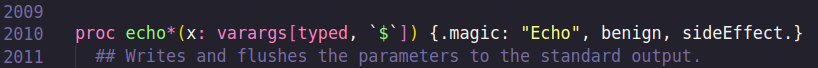

Agora que já cobrimos funções, quero falar sobre outras 2 coleções que são diretamente ligadas a funções, OpenArrays e Varargs, e também vou aproveitar que falar apenas sobre isso seria muito pouco para um post, e vou falar soubre outra cleção que ficou faltando no post 4, HashMaps por achar meio complicado.

- OpenArrays
Um problema que se você prestou atenção enquanto lia o post 4, é que depois de ver sobre funções você pode estar pensando "Como eu posso passar Arrays como parametros, se todo array precisa ter seu tamanho conhecido em tempo de compilação?" E se você não pensou não tem problema, mas a resposta é simples. OpenArrays, o OpenArrays é uma coleção que permite escrever funções que recebem arrays como parametros, como visto no exemplo abaixo.

Você pode estar pensando, como eu pensei na primeira vez "Mas qual a diferença de usar OpenArrays no lugar de Seq's? Não seria o mesmo?" E a resposta é que depende, na maioria dos casos, sim, usar Seq ou OpenArrays vai dar na mesma, porem a vantagem de usar OpenArrays é que Arrays sempre são melhores do que sequencais no quesito de memory safety e performance. E se você não confia em min, aqui esta o relato do proprio criador de Nim.

Nessa mesma thread ele explica mais do por que usar OpenArrays ao invês de Seq's, e um dos motivos é que OpenArrays são compativeis com Seq's, então você pode usar com Seq's sem problema. Alem de que ficar alterando o tamanho de uma Seq como já foi discutido é uma operação que custa memoria e tempo de execução, e acaba sendo algo muito raro de ser feito, e na maioria das vezes que é preciso, é facil contornar a situação.

- Varargs

Dependendo da lingugem que você veio, provavelmente você já criou funções que recebem uma quantidade arbitraria de parametros, afinal elas são uteis para não precisamos lidar multiplas funções ou queremos precisar ficar criando arrays manualmente, seja em Python com *args ou em JavaScript com spread. Em Nim isso também é possivel com os Varargs.

Como o padrão esperado, você lidar com Varags vai gera um array com os valores passados, porem com a diferença sendo principalmente na sintaxe se comprar com os OpenArrays, o que pra min já é melhor que os OpenArrays. Porem o detalhe, que diferencia Varags de OpenArrays, ao nivel de codigo, é que ele pode altomaticamente aplicar uma função a todos os valores.

Isso é algo que pode parecer mais legal do que util, porem lembre que ao lidar com API's, você vai receber um monte de valores que podem não estar de acordo com o os padrões do seu projeto, então poder aplicar uma função diretamente ao chamar uma API para já receber os valores normalizados é algo muito util. Ou ate quando você quer realizar um Map, de uma forma mais especifica. De fato, Varags é algo mais util saber que exite do que para usar, pois as situações onde ele vai ser mais util que um map, são um tanto quanto raras, um exemplo do uso é a propria função echo, que usa a função `$` que como já dito em posts passados, é o toString de Nim.

Então sim, existem lugares onde Varags vão ser muito uteis, porem não vai ser 100% das vezes. Porem você pode ser como eu, e usar sempre que você quiser no lugar de um OpenArrays ou seq pq fica mais bonitinho na hora de escrever e ler o codigo.

- Hash Map

Com os topicos principais cobertos, vamos falar sobre Hash Maps, uma das estruturas de dados mais uteis. Em Nim, HashMap tem possuem o nome de Tables(eu relamente não entendo essa mania que o povo tem de chamar HashMap de tantos nomes diferentes, Python são Dicionarios, Ruby é Hash apenas, Go é Map). Tables em Nim são tão faceis de serem usadas como em Python, basta indicar a Chave e o Valor e pronto.

Como mostrado existe 2 formas de criar Table, seja apenas iniciando elas sem dar nem um valor, ou utilizando o .toTable, naquela coisa similar a um JSON(Tecnicamente existe uma terceira, porem a diferença é pequena o bastante para poder passar por agora). Geralmente antes eu explico o que vai ter no exemplo e depois mostro, porem para facilitar vou primeiro mostrar algumas funções sobre HashMaps e depois vou explicar cada uma.

1º a criação de um dicionario apartir de de sequencias, podemos usar o zip para juntar 2 sequencias e usar os valores da primeira como chave e os da segunda como valor. 2º a adição de valores utilizando os couchetes `[]` com a chave e indicado o valor. 3º a função "hasKeyOrPut", que o que ela faz é bem auto esplicativo, se um hashmap não tiver um valor, ele sera adicionado, sera retornado true caso o valor exista e false caso ele tiver sido criado. 4º "getOrDefault", ele tenta retornar um valor, porem caso o valor não exista ele retorna o valor 0 do tipo, para inteiros é o 0, para strings é uma string vazia, assim por diante. 5º "del" simplesmente remove uma chave, e caso a chave não exista não acontece nada. 6º ".mpairs" retorna uma lista com todas as chaves e valores, note que são dados sem uma ordem, pois HashMaps não possui uma ordem(também existe o "keys", que faz o mesmo porem passando apenas as chaves). E por fim, o "clear", o clear simplesmente zera a tabela removendo todos os valores e chaves.

"Mas e se eu quiser que os valores estivessem ordenados?" Para isso existe a variação do table, a OrderedTable, que é basicamente a mesma coisa porem diferente, afinal ela possui uma ordem em seus valores. È tão facil de usar quanto a table normal, porem com a facilidade da ordem. Tanto que ue posso paenas trocar o "initTbale" para "initOrderedTable" e nada acontece, apenas, agora temos a ordem preservada.

Alem do que eu falei existem inumeras outras formas de utilizar HashMap, na documentação ofical esta listada tudo que esta disponivel nativamente, existe também outro tipo de HashMap que eu não falei, o CountTable, que basicamente pega cada valor uma lista ou sequencia como key, e conta quantas vezes este valor se repete. Qualquer duvida, a documentação de Nim esta a sua disposição. 