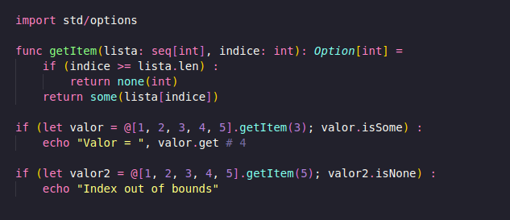
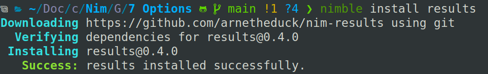
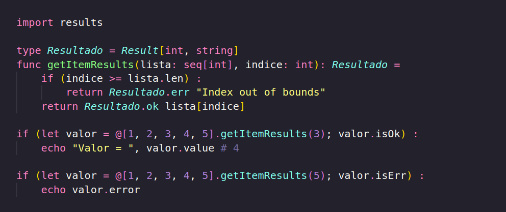
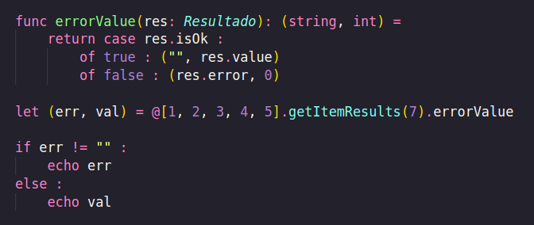

AVISO: Esse post é feito sem revisão ou supervisão de um adulto. Erros no meu entendimento sobre o assunto são esperados, estou escrevendo esses posts para registra meu aprendizado(ou tentativa de). Esses posts são pensando para quem já sabe programar e quer aprender ver sobre Nim, não para programadores de primeira viagem, porem podem ser lidos para completos novatos sem grandes dificuldades. Agradecimento e Créditos a Pamela Yeung Ribeiro por disponibilizar as artes para as capas.

Este post vai ser menor que de costume por ser um assunto simples, porem vai ser especial para quem vem de linguagens funcionais, ou Rust, pois hoje vamos falar da qual na minha opinião(que é a correta) é a melhor forma de lidar com erros envolvendo acessar algo, Options. Caso você não saiba o que significa um Options, em resumo, é quando você por exemplo, tenta acessar um valor em uma lsita que talvez não exista, e caso não exista, invés de gerar um erro e você precisar ter aquele código feio, será retornado um Options, um None(T) caso o valor não exista, e um Some(T) caso ele exista. Vamos começar justamente com este exemplos

Como desmontado, basta importar o Option e definir como retorno da função. Options é uma funcionalidade extremamente simples, porem desde que se começa a utilizar, quando se vai para outras linguagens que ou não possuem options, como Python ou Go, ou possuem de forma ruim, como Java, acaba se torna uma trava durante o desenvolvimento, uma boa analogia, é falar que ter Options é como uma espátula, e não ter Options seria precisar usar uma colher, você sim pode, raspa uma panela usando uma colher, porem utilizar uma espatula torna torna tudo mais facil e rápido, o mesmo se aplica aos Options. Enquanto tendo options, você só precisa utilizar um if para verificar, tendo que lidar com erros você precisa usar os try catch além de as vezes não ter certeza qual erro você precisa lidar.

Você de Rust, deve esta pensando "se tem options então também tem result, correto?". E a resposta é infelizmente, não, pelo menos não nativamente, pois existe o Nim Results, que faz o papel. Isso é por hora, é a única coisa que eu falei "Puts Araq, vacilo em amigo", e de fato não parece ser uma funcionalidade prevista para ser adicionada ao Nim, ao menos é o que da a entender seguindo algumas respostas dele a algumas perguntas no forum. Instalar a biblioteca é simples, basta usar o rodar "nimble install results" e pronto, sim, eu sei, ainda não falei sobre o Nimble, mas é como o Cargo é para o Rust, ou o Pip pro Python, é um gerenciador de projetos que também gerencia pacotes.

Agora com Results instalado, já podemos utilizar a vontade em nosso código, e vamos reaproveitar o exemplos anterior porem desta vem utilizando os results.

Como demonstrado, realmente não existem muitas dificuldades, basta declara um Result com os tipos que você deseja dar ao resultado e ao tipo, e também não possui muita diferença em código entre usar Options e Results, exceto, que utilizando Results, podemos disponibilizar uma mensagem de erro de acordo com o ocorrido. Alguns podem estar se perguntando se sempre é melhor utilizar Results no lugar de Options, e a reposta é não, existem casos onde ou não é preciso uma mensagem de erro, porem não é fácil dizer "Neste caso você usa, neste não" é muito de se acostumar com as duas ideias e saber aplicar. E eu não vou entrar mais a fundo sobre como Options podem ser utilizados em programação funcional, pois estão relacionados aos tão temidos Monads, e porque eu também não sei como funciona direito.

Agora uma coisinha simples para você que vem de Go(bem vindo, por favor tenha amor proprio e conitnue com a gente) é possivel utilizando os Results fazer algo similar a como é feito em Go o tratamento de erros, basta criarmos uma função para simular isso.

Bonitinho né? Eu sei.

Como eu tinha dito, este post seria e foi bem menor do que de costume, pois não é um assunto muito complexo ou que seja preciso muito desenvolvimento, eu realmente so queria cobrir este tópico, e não realmente sabia onde colocar, se fosse no post sobre funções ele ficaria muito grande, então não tinha muito onde trabalhar com isso. Acredito que agora podemos seguir para tipos complexos e depois seguir para módulos, e assim teremos terminado o básico sobre Nim. É isso. Continue estudando, e nos ajude a tornar Nim algo real no Brasil.

Links - 

Options - https://nim-lang.org/docs/options.html

Results - https://github.com/arnetheduck/nim-results

