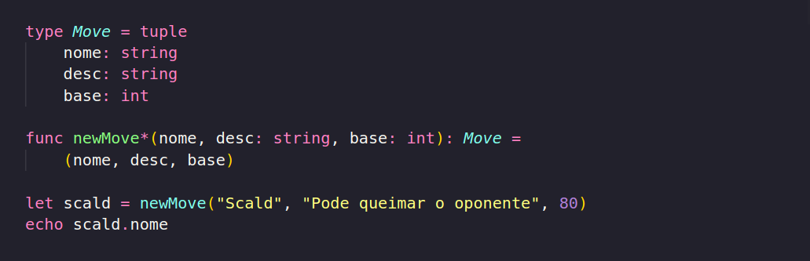

AVISO: Esse post é feito sem revisão ou supervisão de um adulto. Erros no meu entendimento sobre o assunto são esperados, estou escrevendo esses posts para registra meu aprendizado(ou tentativa de). Esses posts são pensando para quem já sabe programar e quer aprender ver sobre Nim, não para programadores de primeira viagem, porem podem ser lidos para completos novatos sem grandes dificuldades. Agradecimento e Créditos a Pamela Yeung Ribeiro por disponibilizar as artes para as capas.

---

Finalmente vamos tratar do principal assunto em quase qualquer linguagem, tipos complexos(A.k. Objetos, estruturas, tipos algébricos, etc...). A parte que eu não estava empolgado para cobrir(por mais que eu tenho demorado mais de 3 meses para continuar, faculdade é foda). Antes de qualquer coisa eu preciso deixar claro uma coisa, OBJETOS EM NIM NÃO EXISTE, os tais objetos criados pelo __object__ são apenas um enfeite para uma estrutura, como Nim """""transpila"""""(se vc falar que Nim transpila pra C tu pode levar um soco, então cuidado) para C, e C não possui objetos, tudo no final é convertido para estruturas, porem, sim, Nim possui algumas sintaxes para fazer parecer com objetos, como criar funções com Methods, por mais que eu não use, simplesmente porque "methods" é maior que "proc", e porque o compilador é um pouco chato com relação a uso methods. Aviso dado, vamos ao que importa. 

---

Existem algumas formas de se criar tipos, você pode criar sinônimos, que seria criar um valor que é igual a outro tipo, seja um tipo primitivo, ou outro tipo complexo, porem com outro nome, como no exemplo abaixo.

Porem você, sim, pode criar tipos distintos, a ideia é a mesma, um valor que fusiona igual a outro tipo, porem usando distinct, o seu tipo não pode ser operado de forma crua com outros do tipo base. Para isso você precisaria escrever as funções para isso.

Sinônimos são utilizados em casos que algo deve ser tratado de um modo específico, porem que não se distancia de um int da vida, como o exemplo usando idades, porem poderia ser diferentes moedas, poderia ser valores físicos como temperatura ou velocidade.

Como eu tive que fazer para somar centímetros com metros, eu também tive que fazer a soma de centímetros com centímetros, e teria que fazer metros com metros caso quisesse, pois quando se cria tipo distintos, você precisa criar todas as funções básicas que queira, o mesmo se aplica a o resto envolvendo types.

---

Tuplas, eu não vou falar muito sobre, pois não tem muitos motivos para usar tuplas ao invés de objetos, porem é bom você saber que existe caso se encontre com um caso onde seja preciso, ou caso você apenas queira, não sou eu que vou te impedir de usar.

Não é obrigatório o uso da nomenclatura dos valores, porem como eu já disse no post sobes coleções, se você não fizer a gang do Clean Code vai invadir sua casa trocar a ração do seu cachorro por ração de gato, então de nome aos valores das tuplas. Fora isso o uso é o mesmo. Algo a ressaltar é que tuplas também caem no conceito de Sinônimos e Distintos, então caso não queira que por acidente, sua tupla seja confundida com outra tupla que por coincidência tenha os mesmos campos, crie com Distinct. 

---

Agora vamos falar sobre os tais Objetos, primeiro, como dito, Nim não possui objetos, porem para ser mais palpável para programadores de OO, que infelizmente é a maioria, Nim permite alguns conceitos de OO como herança e polimorfismo (tudo bem que polimorfismo é um conceito roubado de funcional para OO, porem n é hora para isso) porem ainda assim de longe não possui 1/3 da burocracia, e pipipi popopo que tem por trás.

Não há muita diferença entre o uso de objetos ao uso de tuplas, para os métodos é utilizado funcs e procs, sim, tem como criar com a keyword "method", porem a diferença é menor do que o trabalho de precisar escreve "method", e também às vezes você precisa usar alguns pragmas, então é só mais fácil utilizar proc para mudar o objeto ou func para retornar algo. 

Algumas obervações que precisam ser dadas. O "ref" na declaração do objeto significa que sempre que este objeto for utilizado, ele será passado como uma referência, ou seja, vai ser mutável por padrão, caso você queira criar objetos imutáveis, primeiro vc cria com let, e não com var, porem você pode não colocar o "ref", assim você não terá acesso ao objeto original ao chamar uma função, porem ainda assim se vc declara self como var no cabeçalho da função vai se tornar mutável. Então apenas crie como let, mais fácil.

Herança em Nim é muito simples, a principal diferença é 1 key world a mais na declaração do objeto "of", isso vai indicar de qual objeto sera herdado os atributos. Nota, o objeto a qual será herdado precisa herdar de RootObj, por quê? Não sei.

Algo a se dar nota, é que um objeto apenas herda os atributos, e não os métodos, pois como Nim funciona passando o valor como primeiro parâmetro na função que esta sendo chamada, o que acontece é que todas as funções que recebem Pessoa, pode receber Estudante, porem as funções que recebem Estudante, não podem receber Pessoa. E não existe uma forma fácil de se declarar os valores do objeto raiz, como o super séria em java, então você precisa manualmente declarar um por um, o que pode ser chato, porem herança não é algo muito utilizado de qualquer modo, às vezes você vai até simplesmente colocar um objeto dentro de outro como um valor, invés de usar herança.
---

Não tem muito mais o que desenvolver sobre os tipos em Nim, é basicamente isso, agora o que teria para desenvolver seria o seu uso, eu pretendo cobrir em uma futura série sobre estrutura de dados e algoritmos, bem mais focada na parte de estrutura de dados, porem so irei tratar após lançar o post sobre testes, que será o 10º post. Eu sei que ficou faltando falar sobre enums, mas eu pretendo falar melhor sobre em um post proprio. O próximo post tratara sobre módulos, no caso, como que podemos usar nossas funções e objetos em outros arquivos, após isso, testes, e terei finalizado tudo que se diz respeito ao básico, depois disso só faltaram coisas mais complicadas como gerenciamento de memória manual, alem de templates e macros, 2 assuntos os quais eu ouvi falar que é praticamente inútil em 95% do tempo, mas que nos 5% que é útil é a única solução boa, talvez um dia venha a cobrir, mas não prometo nada. É isso. Continue estudando, e nos ajude a tornar Nim algo real no Brasil.